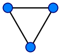
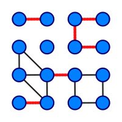
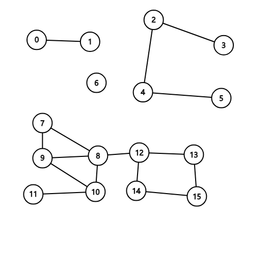
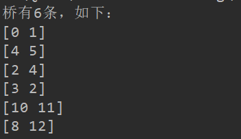
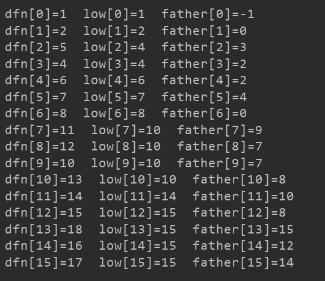

# 实验5 桥

### 实验五 图论——桥问题

### 一、实验目的：

1. 掌握图的连通性。
2. 掌握并查集的基本原理和应用。

### 二、内容：

**1. 桥的定义**

在图论中，一条边被称为“桥”代表这条边一旦被删除，这张图的连通块数量会增加。等价地说，一条边是一座桥当且仅当这条边不在任何环上。一张图可以有零或多座桥。

图 1 没有桥的无向连通图 图 2 这是有16个顶点和6个桥的图

> （桥以红色线段标示）

**2. 求解问题**

找出一个无向图中所有的桥。

**3. 算法**

（1）基准算法

> For every edge (u, v), do followinga) Remove (u, v) from graphb) See if the graph remains connected (We can either use BFS or DFS)c) Add (u, v) back to the graph.

for (u,v) in edges:

delete (u,v)

init(visit[])

dfs(u)

if visit[v] == false:

add (u,v) to qiao

**（2）应用并查集设计一个比基准算法更高效的算法。不要使用Tarjan算法，如果使用Tarjan算法，仍然需要利用并查集设计一个比基准算法更高效的算法。**

### 三、实验要求

1. 实现上述基准算法。
2. 设计的高效算法中必须使用并查集，如有需要，可以配合使用其他任何数据结构。
3. 用图2的例子验证算法正确性。

并查集-找环-LCA算法

算法原理：

首先使用BFS进行遍历得到BFS树，同时得到树边，之后将提取出非树边，环只有可能出现在含有非树边的边集里面，所以对于每一条非树边，找出边两端的最近公共祖先，然后将公共祖先下到这两点之间的点全部都设置标志为其公共祖先的序号，即把他们作为同一个环。最后，桥只可能出现在树边中，我们对树边进行遍历，判断边两端的端点的标志是否一致，一致则在同一个环，不是桥；不是同一标志则为桥。

> 

1. 使用文件 mediumG.txt和largeG.txt 中的无向图测试基准算法和高效算法的性能，记录两个算法的运行时间。
2. 设计的高效算法的运行时间作为评分标准之一。
3. 提交程序源代码。
4. 实验报告中要详细描述算法设计的思想，核心步骤，使用的数据结构。

测试数据1：myTest0.txt

-db44df56-d80e-4bbd-80e6-8a70babd4f5f.png)

答案：桥有0条

测试数据2：myTest.txt

-7c636902-984c-4451-bb3b-5bdaf7efe22f.png)

答案：

桥有6条
分别是：
0 1
2 3
2 4
4 5
8 12
10 11

测试数据3：mediumDG.txt

-8a07f468-fe27-4712-ad25-ee4d1818f9d3.png)

答案：没有桥

测试数据4：Large.txt

无图

答案：

桥有8条
分别是：
639238 969090
630627 467595
467595 907820
658123 724640
372243 148837
589095 317390
773903 95760
548437 461822

花费时间: 38109ms

测试数据5：test.txt

-ed401355-8572-4ae7-a187-67ea6ebfc464.png)

答案：

桥有3条
分别是：
0 1
4 10
10 11

测试数据6：test2.txt

-907b98a3-8155-4a7b-a047-9f43c836beed.png)

答案：

桥有1条
分别是：
2 3